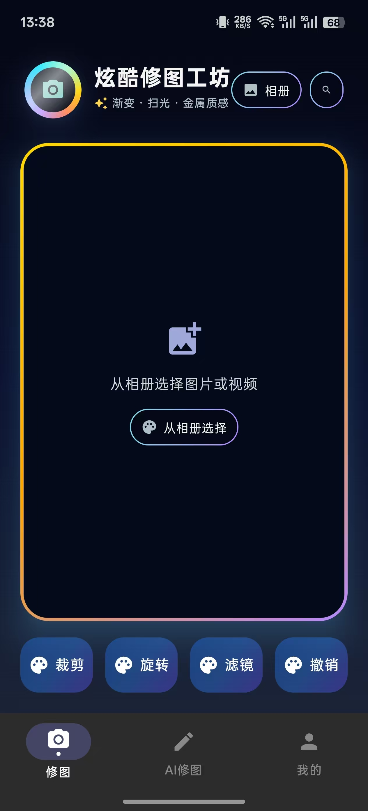
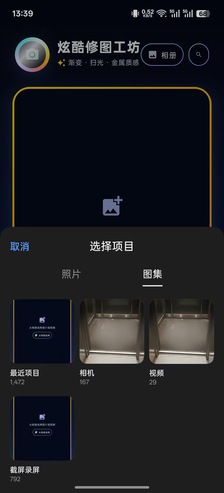
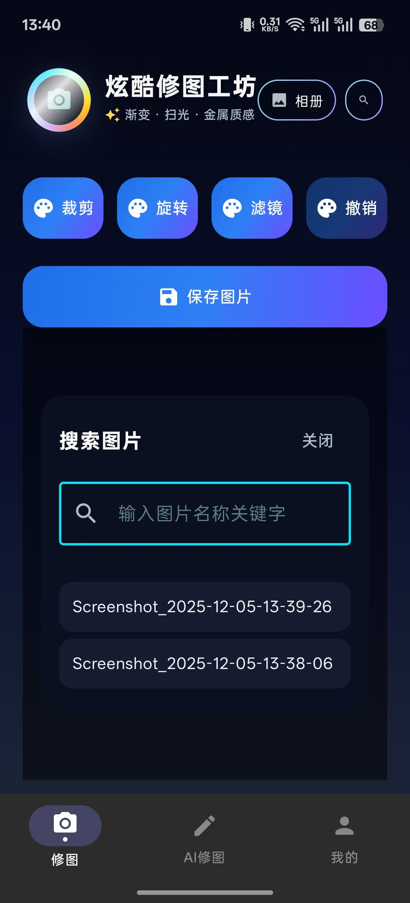
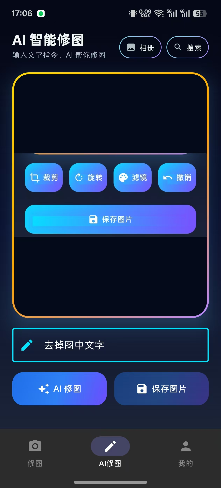

# 炫酷修图工坊 - AI 图像编辑应用

一个功能强大、界面精美的 Android 图像编辑应用，集成了传统图像编辑工具和 AI 智能修图功能。支持图片编辑和 MP4 视频预览。采用 Jetpack Compose 构建，提供流畅的用户体验和现代化的 UI 设计。

## ✨ 核心功能

### 🎨 传统图像编辑
- **媒体选择**：支持从相册选择图片或视频，或通过名称搜索图片

  **界面展示：**
  
  
  *初始界面 - 等待选择媒体文件*
  
  
  *从相册选择图片或视频 - 支持图片和视频文件选择*
  
  
  *通过名称搜索图片 - 快速查找相册中的图片*

- **基础编辑**：
  - 🔄 旋转：90度旋转
  - 🔍 缩放与平移：手势操作，支持双指缩放和拖拽
  - ✂️ 裁剪：可拖拽边缘进行精确裁剪
  - 🎭 滤镜效果：7种内置滤镜（黑白、复古、暖色、冷色、明亮、对比、饱和）
- **撤销功能**：支持操作历史撤销
- **保存功能**：将编辑后的图片保存到相册

### 🎬 视频预览
- **MP4 视频支持**：支持从相册选择并预览 MP4 视频文件
- **自动播放**：选择视频后自动开始播放
- **循环播放**：视频自动循环播放
- **流畅预览**：使用原生 VideoView 实现高质量视频播放

### 🤖 AI 智能修图
- **文本指令编辑**：通过自然语言描述实现图像编辑
  - 示例指令："把背景换成蓝天白云"、"添加彩虹效果"、"变成卡通风格"
- **实时预览**：AI 处理完成后即时预览结果
- **一键保存**：将 AI 处理后的图片保存到相册

  **功能演示：**

  
  *1. 选择一张原始图片*

  
  *2. 输入文字指令，例如“变成卡通风格”*

  
  *3. 查看 AI 处理后的结果*

### 👤 个人中心
- 用户信息展示
- 功能菜单（收藏、历史记录、设置等）

## 🛠️ 技术栈

### 核心技术
- **Kotlin** - 主要开发语言
- **Jetpack Compose** - 现代化 UI 框架
- **Material 3** - Material Design 设计系统
- **OpenGL ES** - 高性能图像渲染与滤镜处理
- **Coil** - 图片加载库
- **OkHttp** - 网络请求库

### 开发工具
- **Android Studio** - 推荐 IDE
- **Gradle** - 构建工具
- **Kotlin DSL** - Gradle 配置

## 📁 项目结构

```
app/src/main/java/com/example/myapplication/
├── MainActivity.kt              # 主入口 Activity，管理底部导航
├── ImageEditorScreen.kt         # 传统图像编辑界面（支持图片和视频预览）
├── AiEditorScreen.kt            # AI 智能修图界面
├── AiImageService.kt            # AI API 服务封装（通义千问）
├── ImageUtils.kt                # 图片处理工具函数
├── ImageSearchDialog.kt         # 图片搜索弹窗组件
├── VideoPlayerView.kt            # 视频播放器组件
├── MediaType.kt                  # 媒体类型判断工具
├── ProfileScreen.kt             # 个人中心界面
├── UiComponents.kt              # 可复用 UI 组件
└── ui/theme/                    # 主题配置
    ├── Color.kt
    ├── Theme.kt
    └── Type.kt
```

## 📋 环境要求

- **Android Studio**：Hedgehog (2023.1.1) 或更高版本
- **JDK**：11 或更高版本
- **Android SDK**：
  - 编译 SDK：36
  - 最低 SDK：24 (Android 7.0)
  - 目标 SDK：36
- **Gradle**：8.13.1 或更高版本
- **Kotlin**：2.0.21 或更高版本

## 🚀 构建与运行

### 1. 克隆项目

```bash
git clone <repository-url>
cd APP_design
```

### 2. 配置 Android SDK

确保已安装 Android SDK，并在 `local.properties` 文件中配置 SDK 路径：

```properties
sdk.dir=C\:\\Users\\YourUsername\\AppData\\Local\\Android\\Sdk
```

> **注意**：`local.properties` 文件已自动生成，通常无需手动修改。如果 SDK 路径不同，请根据实际情况调整。

### 3. 配置 AI API Key（重要）

应用使用阿里云通义千问（Qwen）API 提供 AI 修图功能，需要配置 API Key：

1. 访问 [阿里云 DashScope 控制台](https://dashscope.console.aliyun.com/)
2. 创建 API Key
3. 打开 `app/src/main/java/com/example/myapplication/AiImageService.kt`
4. 找到第 39 行，将 `DASHSCOPE_API_KEY` 替换为你的实际 API Key：

```kotlin
private const val DASHSCOPE_API_KEY = "your-api-key-here"
```

> **安全提示**：生产环境中，建议将 API Key 存储在 `BuildConfig` 或环境变量中，避免硬编码。

### 4. 同步项目

在 Android Studio 中：
1. 打开项目
2. 等待 Gradle 同步完成
3. 如果遇到依赖下载问题，检查网络连接或配置代理

### 5. 运行应用

#### 方式一：使用 Android Studio
1. 连接 Android 设备或启动模拟器（推荐 Android 7.0 或更高版本）
2. 点击工具栏的 "Run" 按钮（绿色播放图标）
3. 或使用快捷键：`Shift + F10` (Windows/Linux) 或 `Ctrl + R` (Mac)

#### 方式二：使用命令行

```bash
# Windows
gradlew.bat assembleDebug
gradlew.bat installDebug

# Linux / Mac
./gradlew assembleDebug
./gradlew installDebug
```

### 6. 安装 APK

构建完成后，APK 文件位于：
```
app/build/outputs/apk/debug/app-debug.apk
```

可以直接安装到设备上。

## 📱 使用说明

### 传统图像编辑

1. **选择媒体**：
   - 点击 "相册" 按钮从相册选择图片或视频（支持 MP4 等格式）
   - 或点击 "搜索" 按钮通过名称搜索图片（仅支持图片搜索）

2. **编辑图片**（仅图片支持编辑）：
   - **旋转**：点击 "旋转" 按钮，每次旋转 90 度
   - **缩放/平移**：在图片上使用双指缩放或单指拖拽
   - **裁剪**：点击 "裁剪" 按钮，拖拽边缘调整裁剪区域
   - **滤镜**：点击 "滤镜" 按钮，选择喜欢的滤镜效果
   - **撤销**：点击 "撤销" 按钮恢复上一步操作

3. **预览视频**（选择视频时）：
   - 选择视频后自动开始播放
   - 视频会自动循环播放
   - 视频模式下不显示编辑工具（仅预览功能）

4. **保存图片**（仅图片）：
   - 点击 "保存图片" 按钮
   - 图片将保存到相册的 `Pictures/EditedImages` 文件夹

### AI 智能修图

1. **选择图片**：同传统编辑，从相册或搜索选择图片

2. **输入指令**：
   - 在文本框中输入修图指令
   - 示例：
     - "把背景换成蓝天白云"
     - "添加彩虹效果"
     - "变成卡通风格"
     - "让图片更明亮"

3. **处理图片**：
   - 点击 "AI 修图" 按钮
   - 等待 AI 处理（显示处理进度）
   - 处理完成后预览结果

4. **保存结果**：
   - 点击 "保存图片" 按钮
   - 图片将保存到相册的 `Pictures/AIEditedImages` 文件夹

### 权限说明

应用需要以下权限：
- **网络权限**：用于调用 AI 图像编辑 API
- **读取媒体图片权限**：
  - Android 13+ (API 33+)：`READ_MEDIA_IMAGES`
  - Android 12 及以下：`READ_EXTERNAL_STORAGE`
- **读取媒体视频权限**（用于视频预览）：
  - Android 13+ (API 33+)：`READ_MEDIA_VIDEO`
  - Android 12 及以下：`READ_EXTERNAL_STORAGE`（与图片权限共用）

首次使用搜索图片功能时，应用会请求相应权限。选择视频文件时，系统会自动处理权限请求。

## 🎨 UI 设计特点

- **深色主题**：采用深色背景（`#050816`），护眼且现代
- **渐变效果**：按钮和边框使用渐变色彩，视觉效果丰富
- **动态动画**：头像扫光效果、按钮按压反馈
- **发光阴影**：图片预览区域带有发光阴影效果
- **Material 3**：遵循 Material Design 3 设计规范

## ⚠️ 注意事项

1. **API Key 配置**：
   - AI 修图功能需要有效的 DashScope API Key
   - 未配置或配置错误的 API Key 会导致 AI 修图功能无法使用
   - API 调用可能产生费用，请查看阿里云定价

2. **网络连接**：
   - AI 修图功能需要稳定的网络连接
   - 处理时间取决于网络速度和图片大小

3. **媒体格式**：
   - **图片格式**：支持常见图片格式（JPEG、PNG、GIF、WebP、BMP 等）
   - **视频格式**：支持 MP4、AVI、MOV、MKV、3GP、WebM 等常见视频格式
   - 建议使用 JPEG 格式图片和 MP4 格式视频以获得最佳性能

4. **性能优化**：
   - 大尺寸图片可能影响编辑性能
   - 建议在编辑前适当压缩图片

5. **存储空间**：
   - 确保设备有足够的存储空间保存编辑后的图片

## 🔧 故障排除

### 问题：Gradle 同步失败
- **解决方案**：检查网络连接，或配置 Gradle 代理

### 问题：AI 修图功能无法使用
- **解决方案**：
  1. 检查 API Key 是否正确配置
  2. 检查网络连接
  3. 查看 Logcat 日志获取详细错误信息

### 问题：无法选择图片或视频
- **解决方案**：
  1. 检查是否授予了读取媒体权限（图片和/或视频）
  2. 在系统设置中手动授予权限
  3. Android 13+ 需要分别授予图片和视频权限

### 问题：保存图片失败
- **解决方案**：
  1. 检查存储空间是否充足
  2. 检查是否授予了存储权限（Android 10 以下）

### 问题：视频无法播放
- **解决方案**：
  1. 确认视频文件格式是否支持（推荐 MP4）
  2. 检查视频文件是否损坏
  3. 确认设备有足够的性能播放视频
  4. 尝试使用其他视频播放器验证文件是否正常

## 📦 依赖库

主要依赖库版本：

- `androidx.compose.bom:2024.09.00` - Compose BOM
- `androidx.compose.material3` - Material 3 组件
- `io.coil-kt:coil-compose:2.6.0` - 图片加载
- `com.squareup.okhttp3:okhttp:4.12.0` - 网络请求
- `androidx.compose.material:material-icons-extended:1.7.5` - 图标库

> **注意**：视频播放功能使用 Android 原生 `VideoView`，无需额外依赖。

完整依赖列表请查看 `app/build.gradle.kts`。

## 🤝 贡献

欢迎提交 Issue 和 Pull Request！

## 📄 许可证

本项目采用 MIT 许可证。详情请参阅 [LICENSE](LICENSE) 文件。

## 📞 联系方式

如有问题或建议，请通过以下方式联系：
- 提交 Issue
- 发送邮件

---

**享受你的图像编辑和视频预览之旅！** 🎨🎬✨
